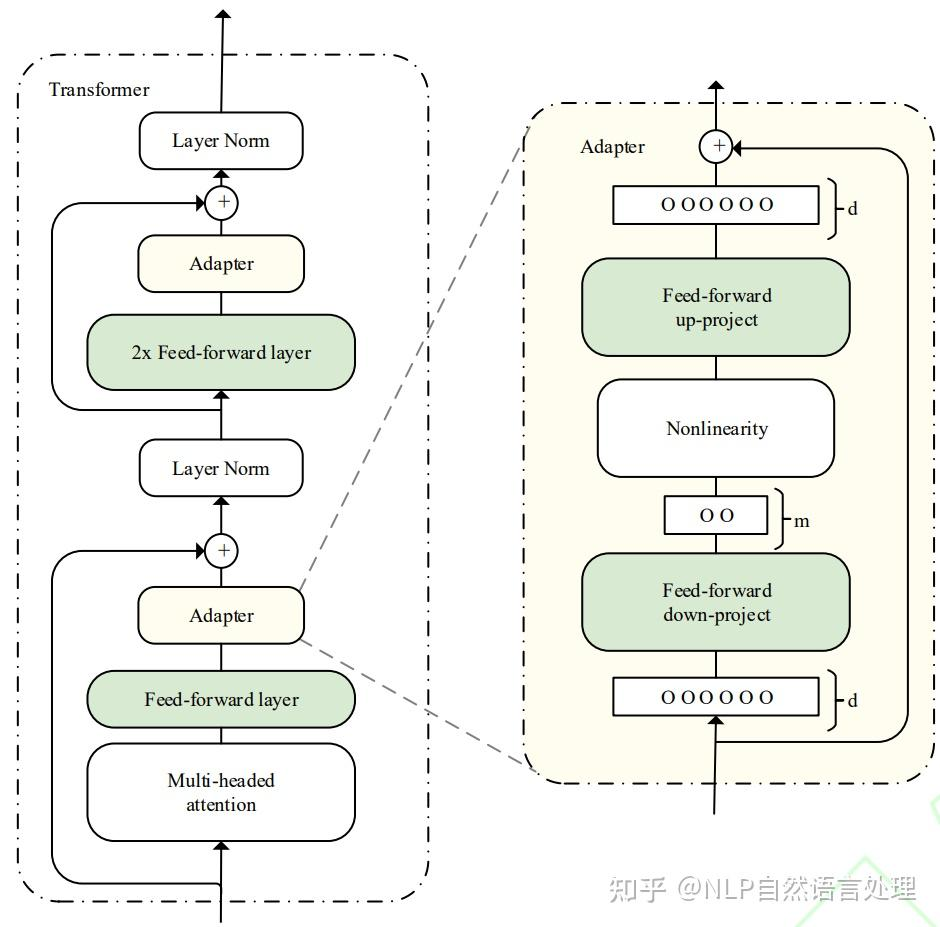
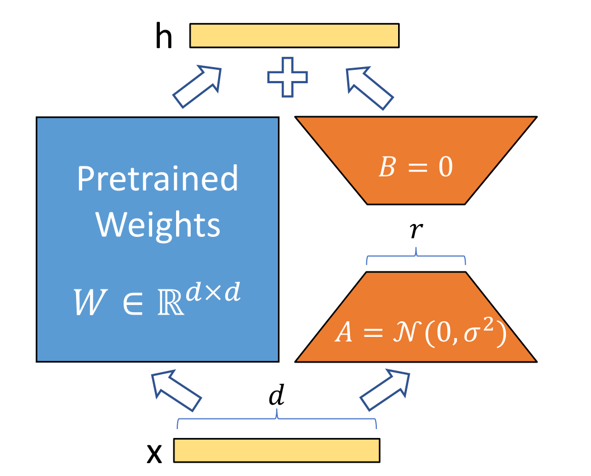

# 深入浅出 LoRA

> *作者：[nowadays0421](https://github.com/nowadays0421)*

**论文：[LoRA: Low-rank Adaptation of Large Language Models](https://arxiv.org/pdf/2106.09685.pdf)**

## 一、什么是 LoRA

### 1.1 针对的问题

全量参数 Fine-tune 需要调整模型全部参数，随着预训练模型规模的不断扩大（GPT-3，175B），全量 Fine-tune 的资源压力也倍增。高效、快速对模型进行领域或任务的微调，在大模型时代极其重要。

### 1.2 替代解决方案

针对全量 Fine-tune 的昂贵问题，目前主要有两种解决方案：

**Adapt Tuning**。即在模型中添加 Adapter 层，在微调时冻结原参数，仅更新 Adapter 层。

具体而言，其在预训练模型每层中插入用于下游任务的参数，即 Adapter 模块，在微调时冻结模型主体，仅训练特定于任务的参数。



每个 Adapter 模块由两个前馈子层组成，第一个前馈子层将 Transformer 块的输出作为输入，将原始输入维度 $d$ 投影到 $m$，通过控制 $m$ 的大小来限制 Adapter 模块的参数量，通常情况下 $m << d$。在输出阶段，通过第二个前馈子层还原输入维度，将 $m$ 重新投影到 $d$，作为 Adapter 模块的输出(如上图右侧结构)。

LoRA 事实上就是一种改进的 Adapt Tuning 方法。但 Adapt Tuning 方法存在推理延迟问题，由于增加了额外参数和额外计算量，导致微调之后的模型计算速度相较原预训练模型更慢。

**Prefix Tuning**。该种方法固定预训练 LM，为 LM 添加可训练，任务特定的前缀，这样就可以为不同任务保存不同的前缀，微调成本也小。具体而言，在每一个输入 token 前构造一段与下游任务相关的 virtual tokens 作为 prefix，在微调时只更新 prefix 部分的参数，而其他参数冻结不变。

也是目前常用的微量微调方法的 Ptuning，其实就是 Prefix Tuning 的一种改进。但 Prefix Tuning 也存在固定的缺陷：模型可用序列长度减少。由于加入了 virtual tokens，占用了可用序列长度，因此越高的微调质量，模型可用序列长度就越低。

### 1.3 LoRA 的思路

如果一个大模型是将数据映射到高维空间进行处理，这里假定在处理一个细分的小任务时，是不需要那么复杂的大模型的，可能只需要在某个子空间范围内就可以解决，那么也就不需要对全量参数进行优化了，我们可以定义当对某个子空间参数进行优化时，能够达到全量参数优化的性能的一定水平（如90%精度）时，那么这个子空间参数矩阵的秩就可以称为对应当前待解决问题的本征秩（intrinsic rank）。

预训练模型本身就隐式地降低了本征秩，当针对特定任务进行微调后，模型中权重矩阵其实具有更低的本征秩（intrinsic rank）。同时，越简单的下游任务，对应的本征秩越低。（[Intrinsic Dimensionality Explains the Effectiveness of Language Model Fine-Tuning](https://arxiv.org/abs/2012.13255)）因此，权重更新的那部分参数矩阵尽管随机投影到较小的子空间，仍然可以有效的学习，可以理解为针对特定的下游任务这些权重矩阵就不要求满秩。我们可以通过优化密集层在适应过程中变化的秩分解矩阵来间接训练神经网络中的一些密集层，从而实现仅优化密集层的秩分解矩阵来达到微调效果。

例如，假设预训练参数为 $\theta^D_0$，在特定下游任务上密集层权重参数矩阵对应的本征秩为 $\theta^d$，对应特定下游任务微调参数为 $\theta^D$，那么有：

$$\theta^D = \theta^D_0 + \theta^d M$$

这个 $M$ 即为 LoRA 优化的秩分解矩阵。

### 1.4 LoRA 的优势

1. 可以针对不同的下游任务构建小型 LoRA 模块，从而在共享预训练模型参数基础上有效地切换下游任务。
2. LoRA 使用自适应优化器（Adaptive Optimizer），不需要计算梯度或维护大多数参数的优化器状态，训练更有效、硬件门槛更低。
3. LoRA 使用简单的线性设计，在部署时将可训练矩阵与冻结权重合并，不存在推理延迟。
4. LoRA 与其他方法正交，可以组合。

## 二、LoRA 的原理

### 2.1 低秩参数化更新矩阵

LoRA 假设权重更新的过程中也有一个较低的本征秩，对于预训练的权重参数矩阵 $W0 \in R^{d \times k}$ ($d$ 为上一层输出维度，$k$ 为下一层输入维度)，使用低秩分解来表示其更新：

$$W_0 + {\Delta}W = W_0 + BA \space\space  where \space B \in R^{d \times r}, A \in R^{r \times k}$$

在训练过程中，$W_0$ 冻结不更新，$A$、$B$ 包含可训练参数。

因此，LoRA 的前向传递函数为：

$$h = W_0 x + \Delta W x = W_0 x + B A x$$

在开始训练时，对 $A$ 使用随机高斯初始化，对 $B$ 使用零初始化，然后使用 Adam 进行优化。

训练思路如图：



### 2.2 应用于 Transformer

在 Transformer 结构中，LoRA 技术主要应用在注意力模块的四个权重矩阵：$W_q$、$W_k$、$W_v$、$W_0$，而冻结 MLP 的权重矩阵。

通过消融实验发现同时调整 $W_q$ 和 $W_v$ 会产生最佳结果。

在上述条件下，可训练参数个数为：

$$\Theta = 2 \times L_{LoRA} \times d_{model} \times r$$

其中，$L_{LoRA}$ 为应用 LoRA 的权重矩阵的个数，$d_{model}$ 为 Transformer 的输入输出维度，$r$ 为设定的 LoRA 秩。

一般情况下，r 取到 4、8、16。

## 三、代码实现

目前一般通过 peft 库来实现模型的 LoRA 微调。peft 库是 huggingface 开发的第三方库，其中封装了包括 LoRA、Adapt Tuning、P-tuning 等多种高效微调方法，可以基于此便捷地实现模型的 LoRA 微调。

本文简单解析 peft 库中的 LoRA 微调代码，简单分析 LoRA 微调的代码实现。

### 3.1 实现流程

LoRA 微调的内部实现流程主要包括以下几个步骤：

1. 确定要使用 LoRA 的层。peft 库目前支持调用 LoRA 的层包括：nn.Linear、nn.Embedding、nn.Conv2d 三种。

2. 对每一个要使用 LoRA 的层，替换为 LoRA 层。所谓 LoRA 层，实则是在该层原结果基础上增加了一个旁路，通过低秩分解（即矩阵 $A$ 和矩阵 $B$）来模拟参数更新。

3. 冻结原参数，进行微调，更新 LoRA 层参数。

### 3.2 确定 LoRA 层

在进行 LoRA 微调时，首先需要确定 LoRA 微调参数，其中一个重要参数即是 target_modules。target_modules 一般是一个字符串列表，每一个字符串是需要进行 LoRA 的层名称，例如：

```python
target_modules = ["q_proj","v_proj"]
```

这里的 q_proj 即为注意力机制中的 $W_q$， v_proj 即为注意力机制中的 $W_v$。我们可以根据模型架构和任务要求自定义需要进行 LoRA 操作的层。

在创建 LoRA 模型时，会获取该参数，然后在原模型中找到对应的层，该操作主要通过使用 re 对层名进行正则匹配实现：

```python
# 找到模型的各个组件中，名字里带"q_proj"，"v_proj"的
target_module_found = re.fullmatch(self.peft_config.target_modules, key)
# 这里的 key，是模型的组件名
```

### 3.3 替换 LoRA 层

对于找到的每一个目标层，会创建一个新的 LoRA 层进行替换。

LoRA 层在具体实现上，是定义了一个基于 Lora 基类的 Linear 类，该类同时继承了 nn.Linear 和 LoraLayer。LoraLayer 即是 Lora 基类，其主要构造了 LoRA 的各种超参：

```python
class LoraLayer:
    def __init__(
        self,
        r: int, # LoRA 的秩
        lora_alpha: int, # 归一化参数
        lora_dropout: float, # LoRA 层的 dropout 比例
        merge_weights: bool, # eval 模式中，是否将 LoRA 矩阵的值加到原权重矩阵上
    ):
        self.r = r
        self.lora_alpha = lora_alpha
        # Optional dropout
        if lora_dropout > 0.0:
            self.lora_dropout = nn.Dropout(p=lora_dropout)
        else:
            self.lora_dropout = lambda x: x
        # Mark the weight as unmerged
        self.merged = False
        self.merge_weights = merge_weights
        self.disable_adapters = False

```
nn.Linear 就是 Pytorch 的线性层实现。Linear 类就是具体的 LoRA 层，其主要实现如下：

```python
class Linear(nn.Linear, LoraLayer):
    # LoRA 层
    def __init__(
        self,
        in_features: int,
        out_features: int,
        r: int = 0,
        lora_alpha: int = 1,
        lora_dropout: float = 0.0,
        fan_in_fan_out: bool = False, 
        merge_weights: bool = True,
        **kwargs,
    ):
        # 继承两个基类的构造函数
        nn.Linear.__init__(self, in_features, out_features, **kwargs)
        LoraLayer.__init__(self, r=r, lora_alpha=lora_alpha, lora_dropout=lora_dropout, merge_weights=merge_weights)

        self.fan_in_fan_out = fan_in_fan_out
        # Actual trainable parameters
        if r > 0:
            # 参数矩阵 A
            self.lora_A = nn.Linear(in_features, r, bias=False)
            # 参数矩阵 B
            self.lora_B = nn.Linear(r, out_features, bias=False)
            # 归一化系数
            self.scaling = self.lora_alpha / self.r
            # 冻结原参数，仅更新 A 和 B
            self.weight.requires_grad = False
        # 初始化 A 和 B
        self.reset_parameters()
        if fan_in_fan_out:
            self.weight.data = self.weight.data.T

```

替换时，直接将原层的 weight 和 bias 复制给新的 LoRA 层，再将新的 LoRA 层分配到指定设备即可。

### 3.4 训练

实现了 LoRA 层的替换后，进行微调训练即可。由于在 LoRA 层中已冻结原参数，在训练中只有 A 和 B 的参数会被更新，从而实现了高效微调。训练的整体过程与原 Fine-tune 类似，此处不再赘述。由于采用了 LoRA 方式，forward 函数也会对应调整：

```python
    def forward(self, x: torch.Tensor):
        if self.disable_adapters:
            if self.r > 0 and self.merged:
                self.weight.data -= (
                    transpose(self.lora_B.weight @ self.lora_A.weight, self.fan_in_fan_out) * self.scaling
                )
                self.merged = False

            return F.linear(x, transpose(self.weight, self.fan_in_fan_out), bias=self.bias)
        '''主要分支'''
        elif self.r > 0 and not self.merged:
            result = F.linear(x, transpose(self.weight, self.fan_in_fan_out), bias=self.bias)
            if self.r > 0:
                result += self.lora_B(self.lora_A(self.lora_dropout(x))) * self.scaling
            return result
        else:
            return F.linear(x, transpose(self.weight, self.fan_in_fan_out), bias=self.bias)

```
上述代码由于考虑到参数合并问题，有几个分支，此处我们仅阅读第二个分支即 elif 分支即可。基于 LoRA 的前向计算过程如前文公式所示，首先计算原参数与输入的乘积，再加上 A、B 分别与输入的乘积即可。

## 四、使用 peft 实现大模型微调

peft 进行了很好的封装，支持我们便捷、高效地对大模型进行微调。此处以开源大模型 ChatGLM2-6B 为例，简要介绍如何使用 peft 对大模型进行微调。此处我们假设数据集已处理完成，不再介绍数据处理过程。

加载所需使用库：

```python
import torch.nn as nn
from transformers import AutoTokenizer, AutoModel
from peft import get_peft_model, LoraConfig, TaskType, PeftModel
from transformers import Trainer
```

首先需要加载原模型与原 tokenizer，此处我们使用 transformers 进行加载：

```python
# 加载底座模型
tokenizer = AutoTokenizer.from_pretrained(MODEL_PATH, trust_remote_code=True)
model = AutoModel.from_pretrained(
    MODEL_PATH, load_in_8bit=False, trust_remote_code=True, device_map="auto"
)
# 对底座模型做一些设置
model.gradient_checkpointing_enable()
model.enable_input_require_grads()
model.is_parallelizable = True
model.model_parallel = True
model.config.use_cache = (
    False  # silence the warnings. Please re-enable for inference!
)
```

接着，设定 peft 参数：

```python
peft_config = LoraConfig(
            task_type=TaskType.CAUSAL_LM,
            inference_mode=False,
            r=8,
            lora_alpha=32,
            lora_dropout=0.1,
        )
```

注意，对不同的模型，LoRA 参数可能有所区别。例如，对于 ChatGLM，无需指定 target_modeules，peft 可以自行找到；对于 BaiChuan，就需要手动指定。task_type 是模型的任务类型，大模型一般都是 CAUSAL_LM 即传统语言模型。

然后获取 LoRA 模型：

```python
model = get_peft_model(model, peft_config)
```

此处的 get_peft_model 的底层操作，即为上文分析的具体实现。

最后使用 transformers 提供的 Trainer 进行训练即可：

```python
trainer = Trainer(
            model=model,
            train_dataset=dataset,
            args=training_args,
            data_collator=lambda x : data_collator_glm(x, tokenizer),
        )
trainer.train()
```

限于篇幅，此处仅简析使用 peft 进行 LoRA 微调的大致流程，关于不同大模型的 LoRA 具体细节、完整实现，请期待本专栏下一篇文章。

## 参考博客

1. [知乎专栏|大模型参数高效微调技术原理综述（五）-LoRA、AdaLoRA、QLoRA](https://zhuanlan.zhihu.com/p/636215898)
2. [知乎专栏|深度学习中的本征维度](https://zhuanlan.zhihu.com/p/612630431)
3. [知乎专栏|预训练模型微调 | 一文带你了解Adapter Tuning](https://zhuanlan.zhihu.com/p/574191259)
4. [知乎专栏|大模型参数高效微调技术原理综述（二）-BitFit、Prefix Tuning、Prompt Tuning](https://zhuanlan.zhihu.com/p/635686756)
5. [CSDN|大模型训练——PEFT与LORA介绍](https://blog.csdn.net/weixin_44826203/article/details/129733930)

## 参考文献

1. [LoRA: Low-rank Adaptation of Large Language Models](https://arxiv.org/pdf/2106.09685.pdf)
2. [Intrinsic Dimensionality Explains the Effectiveness of Language Model Fine-Tuning](https://arxiv.org/abs/2012.13255)
3. [Parameter-Efficient Transfer Learning for NLP](http://proceedings.mlr.press/v97/houlsby19a/houlsby19a.pdf)
4. [Prefix-Tuning: Optimizing Continuous Prompts for Generation](https://arxiv.org/abs/2101.00190)